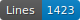
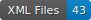

# Data_HTR

    

Données OCR manuscrits de l'île de France (île Maurice) de la fin du XVIIIe siècle et du début du XIXe siècle.

## Corpus

Registres d'affranchissements, registres d'insinuations (actes notariés enregistrés devant le tribunal du greffe comme testaments, contrats de mariage et actes de donations) de l'île de France (1760-1720)

<table>
	<tr><td>Lieu de conservation</td> <td>Type d'actes</td> <td>Cote</td> <td>Folios</td> <td>Date</td></tr>
	<tr><td>National Archvives of Mauritius</td> <td>Affranchissements</td> <td>IE5</td> <td>Echantillons</td> <td>1811</td></tr>
	<tr><td>National Arthives of Mauritius</td> <td>Insinuations</td>  <td>JK10</td> <td>Echantillons</td> <td>1792</td></tr>
	<tr><td>National Arthives of Mauritius</td> <td>Insinuations</td>  <td>JK11</td> <td>Echantillons</td> <td>1794</td></tr>
</table>

## License
  type : <a href="https://creativecommons.org/licenses/by/4.0/">CC-BY</a>
  version : 4.0
	
